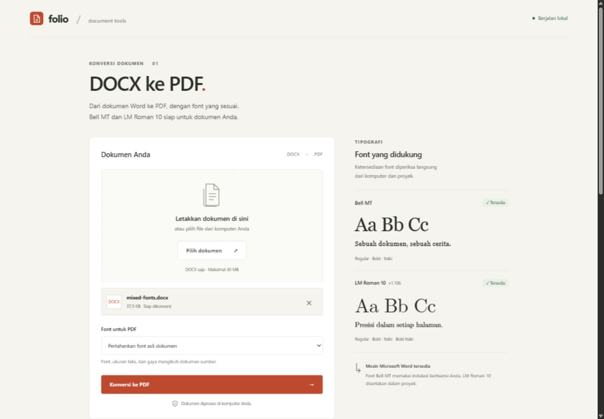

# PDF-Converter

Converter **DOCX ke PDF lokal untuk Windows**, dengan dukungan **Bell MT** dan
**LM Roman 10 versi 1.106**. Antarmuka berbahasa Indonesia dibuka melalui browser. Microsoft
Word desktop menjadi mesin konversi; Python menyediakan server lokal dan
pemeriksaan font pada PDF hasilnya.



## Fitur

- Unggah atau drag and drop satu DOCX, maksimal 30 MB.
- Pertahankan font dokumen, atau ubah teks ke Bell MT / LM Roman 10.
- Ukuran teks, bold, italic, gambar, tabel, dan pengaturan halaman diteruskan ke
  Word. Mengubah font dapat mengubah panjang baris dan jumlah halaman.
- Ekspor PDF melalui Word dan verifikasi embedding kedua font yang didukung.
  Jika font yang diharapkan hilang atau tidak tertanam, hasil ditolak dengan pesan
  yang jelas sehingga substitusi font tidak terjadi diam-diam.
- Font OpenType CFF Latin Modern yang hanya direferensikan Word disematkan
  menggunakan data CFF dari file font asli. Nama font dan pemetaan glyph
  dipertahankan, sehingga teks tetap dapat dipilih dan disalin.
- Pratinjau PDF menggunakan PDF.js lokal dengan navigasi halaman, daftar font
  yang tertanam, jumlah halaman, dan tombol unduh.
- Pemrosesan di komputer sendiri. File kerja dihapus setelah selesai atau gagal.
- Hasil PDF terakhir disimpan hanya di memori untuk tombol unduh HTTP, hingga
  konversi berikutnya atau aplikasi berhenti. Tidak ada riwayat dokumen di disk.
- Font dari folder proyek dimuat sementara untuk sesi konversi tanpa instalasi
  permanen di Windows.

## Persyaratan

1. Windows 10/11.
2. Python **3.11+**, dengan opsi *Add Python to PATH* ketika instalasi.
3. Microsoft Word **desktop**, terpasang dan telah diaktivasi. Buka Word sekali
   untuk menyelesaikan dialog lisensi atau pengaturan awal. Word versi web tidak
   menyediakan mesin COM yang digunakan proyek ini.
4. Bell MT berlisensi dari instalasi Microsoft Office atau sumber milik Anda.

## Menjalankan

Cara cepat: klik dua kali **`start.bat`**. Script membuat virtual environment,
memasang dependensi, dan membuka browser. Internet diperlukan untuk instalasi
dependensi pertama; konversi tidak memerlukan layanan online.

Atau jalankan di PowerShell dari folder proyek:

```powershell
python -m venv .venv
.\.venv\Scripts\python.exe -m pip install -r requirements.txt
.\.venv\Scripts\python.exe app.py --open
```

Alamat aplikasi: **http://127.0.0.1:8765**. Tekan **Ctrl+C** di terminal untuk
menghentikan server. Jika port dipakai aplikasi lain:

```powershell
.\.venv\Scripts\python.exe app.py --port 8766 --open
```

## Dukungan font

| Font | Sumber | Varian |
| --- | --- | --- |
| Bell MT | Font Windows / Office berlisensi pengguna, atau `fonts/custom/` | Sesuai file yang tersedia, biasanya regular, bold, italic |
| LM Roman 10 v1.106 | Disertakan dalam `fonts/latin-modern/v1.106/` | Regular, bold, italic, bold italic |

Nama internal Windows untuk Latin Modern yang digunakan adalah **LM Roman 10**;
nama PostScript di PDF berbentuk **LMRoman10-Regular**, **LMRoman10-Bold**, dll.
Alias **Latin Modern Roman 10** dinormalisasi ke nama keluarga Windows.

Bell MT **tidak disertakan di repository**. Jika belum tersedia, pasang font
berlisensi di Windows atau letakkan file TTF/OTF di `fonts/custom/`, lalu restart
aplikasi. Folder font pribadi diabaikan Git. Hindari mengunggah Bell MT ke repo
publik tanpa izin redistribusi.

Empat file Latin Modern **versi font 1.106** diambil tanpa modifikasi dari
[arsip Latin Modern 1.106](https://ftp.math.utah.edu/pub/tex/historic/fonts/latin-modern/lm-1.106/). Lisensi dan README
asli ada di `fonts/latin-modern/`; rincian sumber ada di `SOURCE.md` dalam folder itu.
Versi diperiksa dari metadata font dan data CFF yang tertanam pada PDF. Varian
LM Roman 10 dengan versi lain tidak digunakan oleh inventory proyek.

Mode **pertahankan font asli** tidak mengganti font lain dalam dokumen. Verifikasi
ketat berlaku untuk Bell MT dan LM Roman 10 yang terdeteksi pada teks dokumen,
header/footer, dan catatan kaki/akhir; daftar font PDF menampilkan hasil aktual.
Dokumen dengan pengaturan font kompleks seperti style tabel, DrawingML/WordArt,
dan persamaan dapat memerlukan pemeriksaan visual tambahan. Nama font PDF dapat
berbeda dari nama yang ditampilkan Word.

## Pengujian

```powershell
.\.venv\Scripts\python.exe -m unittest discover -s tests -v
```

Tes otomatis mencakup font turunan style/theme, perubahan font dengan bold dan
ukuran tetap, namespace Word, DOCX tidak valid, embedding PDF, dan endpoint HTTP.
GitHub Actions menjalankan tes ini tanpa membutuhkan Microsoft Office.

Untuk menguji mesin Word sungguhan pada komputer yang memenuhi persyaratan:

```powershell
.\.venv\Scripts\python.exe scripts/smoke_test.py
```

Script ini menjalankan empat konversi dan memeriksa font pada PDF sungguhan.

Validasi lokal: 20 tes otomatis lolos; dokumen dua halaman dengan tabel,
header/footer, serta semua varian kedua font berhasil dikonversi dan diperiksa
secara visual. Seluruh varian LM Roman 10 di PDF terverifikasi versi 1.106.
Unggah, pratinjau, navigasi halaman, dan unduh diuji melalui browser.
Tampilan diperiksa pada lebar 320, 768, 1024, dan 1440 piksel.

## Struktur

```text
app.py                    Server HTTP lokal dan API
converter/docx.py         Validasi DOCX dan pengaturan font
converter/fonts.py        Deteksi dan pemuatan font sementara
converter/engine.py       Worker Word, batas waktu, pembersihan file
converter/pdf.py          Pemeriksaan font tertanam pada PDF
scripts/word-to-pdf.ps1   Ekspor PDF melalui Microsoft Word
web/                      HTML, CSS, JavaScript
fonts/latin-modern/       Empat font LM Roman 10 dan lisensi
tests/                    Tes unit dan HTTP
```

## API lokal

`GET /api/status` mengembalikan status mesin, ketersediaan font, dan token sesi.
`POST /api/convert` menerima byte DOCX dengan header berikut:

- `X-Converter-Token`: token dari status.
- `X-Filename`: nama DOCX yang di-*percent encode*.
- `X-Font`: `original`, `Bell%20MT`, atau `LM%20Roman%2010`.
- `Content-Type`: `application/vnd.openxmlformats-officedocument.wordprocessingml.document`.

Respons sukses adalah PDF dengan `Content-Disposition` dan
`X-Conversion-Report` berisi JSON yang di-*percent encode*. Kegagalan berupa JSON
`{"error": "pesan"}` dengan kode HTTP sesuai. Server hanya mendengarkan pada
loopback, memeriksa Host, Origin, dan token; CORS tidak diaktifkan.
Header `X-Download-Url` berisi URL lokal dengan ID acak untuk mengunduh PDF terakhir
melalui HTTP. Hasil sebelumnya diganti saat konversi berikutnya berhasil.

## Batasan

Proyek ini ditujukan untuk **pemakaian lokal satu pengguna**, dengan satu
konversi aktif. Word automation memerlukan sesi desktop Windows, sehingga
arsitektur ini tidak ditujukan untuk server Linux, Vercel, atau layanan publik.
Dokumen terenkripsi, macro, objek OLE tersemat, dan gambar/template eksternal
belum didukung. Batas waktu konversi adalah 120 detik. Tata letak tetap dipengaruhi
versi Word dan font sumber yang tersedia.

Ekspor mengikuti
[API resmi Word ExportAsFixedFormat](https://learn.microsoft.com/en-us/office/vba/api/word.document.exportasfixedformat).
Hasil berupa PDF biasa dengan font tertanam, bukan PDF/A. Mode PDF/A Word
mengganti font CFF yang tidak berhasil disematkan; proyek ini memakai PDF biasa
dan menyematkan font CFF asli sesudah ekspor.

## Lisensi

Kode: MIT. Font Latin Modern: GUST Font License. Bell MT mengikuti lisensi sumber
font pengguna. PDF.js: Apache-2.0, dengan lisensi dalam `web/vendor/pdfjs/`.
